# CU Boulder ATOC 1050 Exam 3 Study Document

# Preface

I made this a couple days before Exam 3 for CU Boulder's ATOC 1050 to help me cram all this junk into my head and spit it out on a piece of paper. I do not have a good understanding of these concepts and mainly just copied material from slides. This is unorganized and probably incomplete but does aggregate everything seen on lecture slides since Exam 2. If you stumble across this as a student, please don't use this as the only way to study. Take some practice tests, dude.

# Table of Contents

- [CU Boulder ATOC 1050 Exam 3 Study Document](#cu-boulder-atoc-1050-exam-3-study-document)
- [Preface](#preface)
- [Table of Contents](#table-of-contents)
- [Air Mass](#air-mass)
- [Source Regions](#source-regions)
- [Classifying Air Masses](#classifying-air-masses)
  - [Latitude Categories](#latitude-categories)
  - [Surface Nature Categories](#surface-nature-categories)
  - [Classifications Table](#classifications-table)
- [Air Mass Modification](#air-mass-modification)
- [Properties of Air Masses](#properties-of-air-masses)
- [Lake Effect Snow](#lake-effect-snow)
- [Fronts](#fronts)
  - [Stationary Fronts](#stationary-fronts)
  - [Cold Fronts](#cold-fronts)
    - [Squall Line](#squall-line)
    - [Backdoor Cold Fronts](#backdoor-cold-fronts)
  - [Warm Fronts](#warm-fronts)
    - [Overrunning](#overrunning)
  - [Occluded Fronts](#occluded-fronts)
    - [Cold-Occluded Front (Cold Occlusion)](#cold-occluded-front-cold-occlusion)
    - [Warm-Occluded Front (Warm Occlusion)](#warm-occluded-front-warm-occlusion)
- [Polar-Front Theory (Norwegian Cyclone Model)](#polar-front-theory-norwegian-cyclone-model)
  - [Warm Sector](#warm-sector)
- [Regions for Mid-Latitude Cyclones](#regions-for-mid-latitude-cyclones)
  - [The Colorado Low (Lee-Side Low)](#the-colorado-low-lee-side-low)
  - [Nor'easters](#noreasters)
- [Cyclone Formation](#cyclone-formation)
- [Convergence and Divergence](#convergence-and-divergence)
  - [Convergence](#convergence)
  - [Divergence](#divergence)
- [Upper Level Convergence and Divergence](#upper-level-convergence-and-divergence)
  - [Upper Level Convergence in the Westerlies](#upper-level-convergence-in-the-westerlies)
  - [Upper Level Divergence in the Westerlies](#upper-level-divergence-in-the-westerlies)
- [Weather Forecast](#weather-forecast)
- [Weather Alerts](#weather-alerts)
  - [Weather Advisory](#weather-advisory)
  - [Weather Watch](#weather-watch)
  - [Weather Warning](#weather-warning)
- [Weather Forecasting Tools](#weather-forecasting-tools)
  - [Radiosondes](#radiosondes)
  - [Doppler Radar](#doppler-radar)
  - [Satellite Data](#satellite-data)
    - [Polar Satellites](#polar-satellites)
    - [Geostationary Satellites](#geostationary-satellites)
    - [Infrared Images](#infrared-images)
    - [Water Vapor Images](#water-vapor-images)
- [Weather Reporting](#weather-reporting)
  - [Synoptic Weather Maps](#synoptic-weather-maps)
  - [Meteograms](#meteograms)
  - [Soundings](#soundings)
- [Computer Forecasting](#computer-forecasting)
  - [Numerical Weather Prediction](#numerical-weather-prediction)
  - [Prognostic Charts](#prognostic-charts)
  - [Model Output Statistics (MOS)](#model-output-statistics-mos)
  - [Ensemble Forecasting](#ensemble-forecasting)
- [Other Forecasting Methods](#other-forecasting-methods)
  - [Persistence Forecasting](#persistence-forecasting)
  - [Climatological Forecasting](#climatological-forecasting)
  - [Analog Method](#analog-method)
  - [Trend Forecasting](#trend-forecasting)
  - [Statistical Forecasting](#statistical-forecasting)
  - [Probability Forecasting](#probability-forecasting)
  - [Nowcast](#nowcast)
  - [Short-Range Forecasts](#short-range-forecasts)
  - [Medium-Range Forecasts](#medium-range-forecasts)
  - [Long-Range Forecasts](#long-range-forecasts)
    - [Climate Prediction Center](#climate-prediction-center)
- [Determining the Movement of Weather Systems](#determining-the-movement-of-weather-systems)
- [Thunderstorms](#thunderstorms)
  - [Thunderstorm Frequency](#thunderstorm-frequency)
  - [Anatomy of a Thunderstorm](#anatomy-of-a-thunderstorm)
  - [Vertical Wind Shear](#vertical-wind-shear)
- [Types of Thunderstorms](#types-of-thunderstorms)
  - [Table of Thunderstorm Characteristics](#table-of-thunderstorm-characteristics)
  - [Air-Mass Thunderstorm](#air-mass-thunderstorm)
    - [Cumulus Stage](#cumulus-stage)
    - [Mature Stage](#mature-stage)
    - [Dissipating Stage](#dissipating-stage)
  - [Severe Thunderstorm](#severe-thunderstorm)
  - [Supercell Thunderstorm](#supercell-thunderstorm)
- [Lightning and Thunder](#lightning-and-thunder)
  - [Lightning](#lightning)
    - [Electrical Potential Gradient](#electrical-potential-gradient)
  - [Thunder](#thunder)
- [Lightning Formation](#lightning-formation)
- [Tornadoes](#tornadoes)
  - [Funnel Clouds](#funnel-clouds)
  - [Suction Vortices](#suction-vortices)
  - [Enhanced Fujita Scale (EF Scale)](#enhanced-fujita-scale-ef-scale)
- [Tornado Life Cycle](#tornado-life-cycle)
  - [Dust-whirl Stage](#dust-whirl-stage)
  - [Mature Stage](#mature-stage-1)
  - [Decay Stage](#decay-stage)
- [Tornado Formation](#tornado-formation)
  - [Vortex Tubes](#vortex-tubes)
  - [Rear Flank Downdraft](#rear-flank-downdraft)
  - [Tornado Vortex](#tornado-vortex)
- [Tornado Forecasting](#tornado-forecasting)
- [Useful Pictures](#useful-pictures)
  - [Simplified Surface-Station Model](#simplified-surface-station-model)
  - [Cloud Coverage](#cloud-coverage)
  - [Wind Entries](#wind-entries)
  - [Common Weather Symbols](#common-weather-symbols)
  - [Air Mass Classifications](#air-mass-classifications)
  - [Front Symbols](#front-symbols)
  - [Diagrams of Mid-Latitude Cyclones and Anti-Cyclones](#diagrams-of-mid-latitude-cyclones-and-anti-cyclones)
  - [Lightning Formation Detailed](#lightning-formation-detailed)

# Air Mass

- Immense body of air
- 1600km (994mi) or more across, several km thick
- Homogeneous physical properties

# Source Regions

- Extensive, physically uniform area
- Dominated by stationary/slow-moving anticyclones with extensive areas of calm/light winds

# Classifying Air Masses

[Air Masses](#air-mass) are named based on latitude and nature of surface of source region

## Latitude Categories

- Arctic (A)
- Polar (P)
- Tropical (T)

## Surface Nature Categories

- Maritime (m)
- Continental (c)

## Classifications Table

<!-- The little empty header was bothering me

|    |             |          |
|----|-------------|----------|
| cA | continental | arctic   |
| cP | continental | polar    |
| cT | continental | tropical |
| mT | maritime    | tropical |
| mP | maritime    | polar    |

-->

<table>
<tr>
    <td>cA</td>
    <td>continental</td>
	<td>arctic</td>
</tr>
<tr>
    <td>cP</td>
    <td>continental</td>
	<td>polar</td>
</tr>
<tr>
	<td>cT</td>
	<td>continental</td>
	<td>tropical</td>
</tr>
<tr>
    <td>mT</td>
    <td>maritime</td>
	<td>tropical</td>
</tr>
<tr>
    <td>mP</td>
    <td>maritime</td>
	<td>polar</td>
</tr>
</table>

# Air Mass Modification

As [air masses](#air-mass) move, the air mass affects the location and the location affects the air mass in the following ways:

- Temperature
- Moisture
- Stability (energy exchange, mechanical lifting)

# Properties of Air Masses

| [Class](#classifications-table) | Characteristics | [Source Region](#source-regions) | Weather
|---|---|---|---|
| cP, cA | cold, dry, stable | N. Canada & Alaska | cold dry air, [lake effect snow](#lake-effect-snow) |
| mP | cold, moist, conditionally unstable | N. Pacific & N. Atlantic Oceans | rain/snow |
| mT | warm/hot, moist, unstable | sub-tropical Pacific and Atlantic Oceans, Gulf of Mexico | humid w/ precipitation |
| cT | warm/hot, dry, unstable | northern Mexico | clear skies, hot, no precipitation |

# Lake Effect Snow

Produced when a cold [air mass](#air-mass) moves across a long expanse of warmer water. The lower layer of air picks up water vapor from the lake and rises through the colder air above. Snow is then deposited downwind.

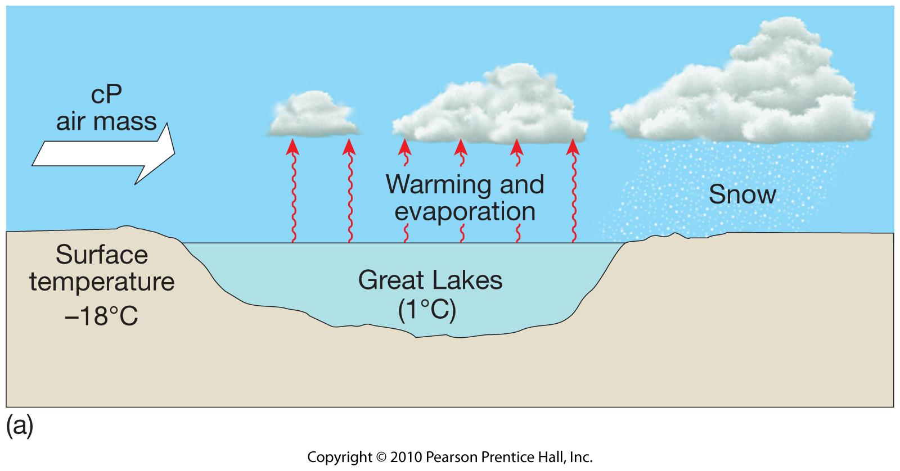

# Fronts

Boundary surfaces that separate [air masses](#air-mass) of different densities

## Stationary Fronts

- Nearly stationary boundary
- Airflow on both sides is parallel to the line of the front
- **Weather:** clear/cloudy skies with possible light rain

## Cold Fronts

- Cold dense air wedges under warm air, forcing the warm air upward
- Moist, unstable warm air condenses and creates cumulus clouds
- Upper level westerly winds create cirrostratus and cirrus clouds out in front
- Thunderstorms, heavy rain, strong winds
- As it passes, temperature drops, winds shift from southwesterly to northwesterly, pressure rises, and precipitation stops
- Leading edge of the front is steep and shallow
- Slopes upward over the cold air at the surface
- Slope is approximately 1:50
- Move quickly with a speed of approximately 25+ knots
- **Weather:** narrow band of precipitation along the cold front with potentially severe thunderstorms directly along the front

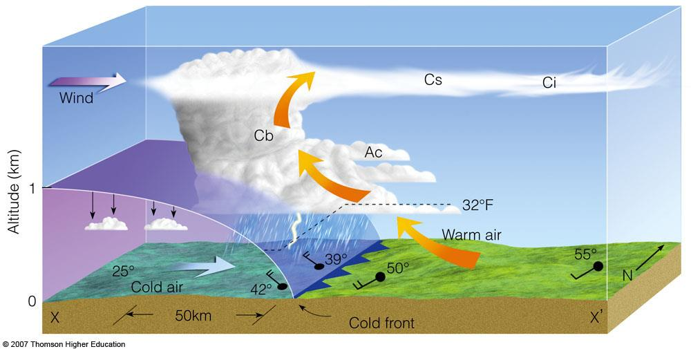

### Squall Line

A line of active showers and thunderstorms that develop parallel to and often ahead of an advancing cold front

### Backdoor Cold Fronts

Cold fronts that move in from the east/northeast (rather than south, southeast, or east). Usually move out of Canada and into the northeastern United States

## Warm Fronts

- Warm, moist air replaces cold, dry air
- Slope is approximately 1:300
- Average speed is approximately 10 knots
- In front, light and variable surface winds, cold temperatures, and high cirrus clouds overhead
- Moves slowly, takes a day or two to pass
- Cirrus clouds gradually thicken into cirrostratus clouds, then altocumulus and altostratus clousd
- Chance of light precipitations with nimbostratus clouds overhead
- Winds become brisk and southeasterly, atmospheric pressure slowly decreases
- Precipitation warms (snow to rain)
- Fog may form at the surface
- After front passes, temperatures increase, dew point increases, winds shift from southeast to south or southwest, atmospheric pressure stops falling, precipitation stops, and most of clouds clear (some stratocumulus will remain)

### Overrunning

The rising of warm air over cold

## Occluded Fronts

Form when a cold front catches up to a warm front

### Cold-Occluded Front (Cold Occlusion)

The air behind the cold front is colder than the air head of the warm front

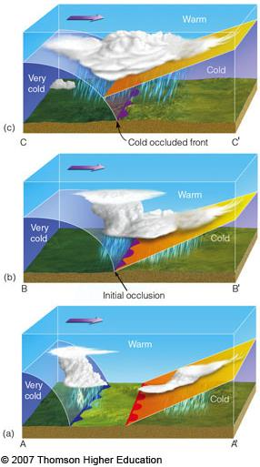

### Warm-Occluded Front (Warm Occlusion)

The air behind the cold front is not as cold as the air ahead of the warm front

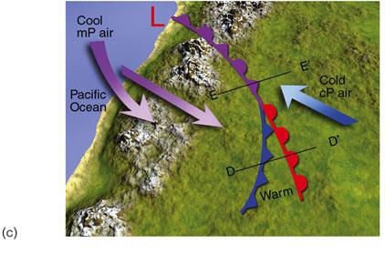
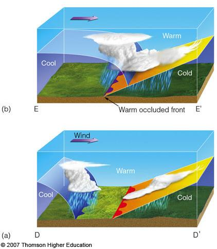

# Polar-Front Theory (Norwegian Cyclone Model)

The majority of weather in the mid-latitudes (Florida to Alaska) is generated by mid-latitude cyclones. The Norwegians were the first to develop an atmospheric model that could predict the development of mid-latitude cyclones.

Wave cyclones develop along the polar [front](#fronts) where there is a large temperature gradient.

1. **[Stationary front](#stationary-fronts):** separates cold polar air from warm sub-tropical air

2. **Frontal wave:** the initial king that forms on the polar front

3. **Open wave:** fully developed cyclone, [warm sector](#warm-sector)

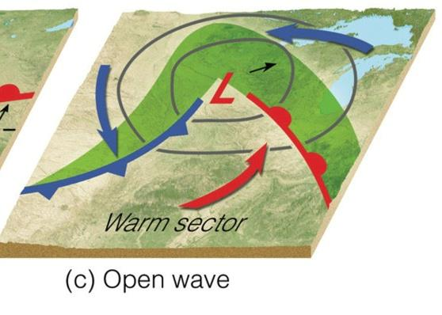

4. **Mature:** pressure drops, winds increase, cold front inches closer to warm front

5. **Advance occlusion:** the cold front has caught up to the warm front, leaving cold air at the surface

6. **Dissipation:** without a surface temperature gradient, the cyclone loses energy and gradually dies out

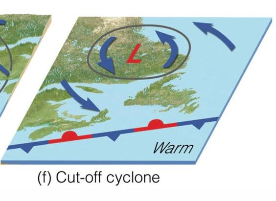

## Warm Sector

The warm air mass located between the cold and warm fronts

# Regions for Mid-Latitude Cyclones

There are regions named for where mid-latitude cyclones form

## The Colorado Low (Lee-Side Low)

As westerly winds blow over a mountain range, the air expands vertically on the downwind (lee) side, which can intensify any pre-existing areas of low pressure

## Nor'easters

East coast mid-latitude cyclone that develops or intensifies off the east coast of N. America in the fall, winter, or spring. They produce strong winds and heavy rain, snow, and sleet

# Cyclone Formation

High pressure at surface associated with surface [divergence](#divergence), with [convergence](#convergence) aloft to maintain surface high pressure.

Low pressure at surface associated with surface [convergence](#convergence), with [divergence](#divergence) aloft to maintain surface low pressure.

# Convergence and Divergence

## Convergence

Atmospheric condition that exists when winds cause a horizontal net inflow of air into a specified region. **Adds mass** to a column of air.

Causes:

- Winds directed towards each other
- When faster winds approach slower winds

## Divergence

Atmospheric condition that exists when winds cause a horizontal net outflow of air into a specified region. **Removes mass** from a column of air.

Causes

- Winds directed away from each other
- When slower winds approach faster winds

# Upper Level Convergence and Divergence

If isobars (or geopotential height contours) have even spacing, the winds will be faster in the region of an upper-level ridge rather than in a region of an upper-level trough

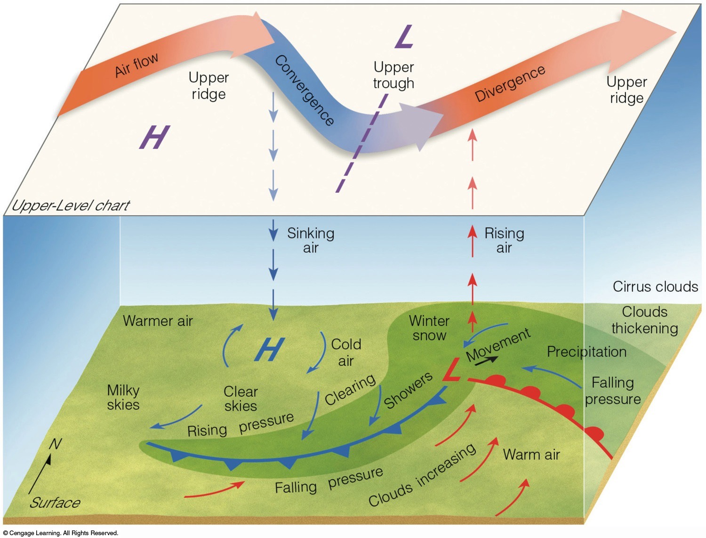

## Upper Level Convergence in the Westerlies

Tends to occur on the west side of an upper level trough (or the east side of an upper level ridge). Occurs when faster winds approach slower winds.

## Upper Level Divergence in the Westerlies

Tends to occur on the east side of an upper level trough (or the west side of an upper level ridge). Occurs when slower winds approach faster winds.

# Weather Forecast

A scientific estimate of the weather conditions at some future time. Includes the following metrics:

- Temperature
- Humidity
- Cloudiness
- Precipitation
- Wind speed
- Wind direction

# Weather Alerts

## Weather Advisory

Issued to inform the public of less hazardous conditions caused by wind, dust, fog, snow, sleet, or freezing rain

## Weather Watch

Indicates that atmospheric conditions favor hazardous weather occuring over a particular region during a specified time period

## Weather Warning

Indicates that hazardous weather is either imminent or actually occuring within the specified forecast area

# Weather Forecasting Tools

## Radiosondes

A light instrument carried by a balloon to take temp, humidity, and pressure measurements vertically throughout the atmosphere

## Doppler Radar

Determines the velocity of falling precipitation either toward or away from the radar unit by taking into account the doppler shift

## Satellite Data

Satellite images are useful for forecasting, especially over the ocean and polar regions

### Polar Satellites

Circle the earth in a north-south direction

### Geostationary Satellites

Placed in an orbit over the equator. Remain at a fixed point above the Earth, traveling at the same rate that the Earth rotates.

### Infrared Images

Obtained by detecting radiation emitted by objects, which gives information about the temperature of the object

### Water Vapor Images

Measures how much water vapor is in the air by detecting the wavelength emitted by water vapor

# Weather Reporting

## Synoptic Weather Maps

Give a picture of the weather at a given point in time

## Meteograms

A chart that shows how one or more weather variables has changed at a station over a given time period

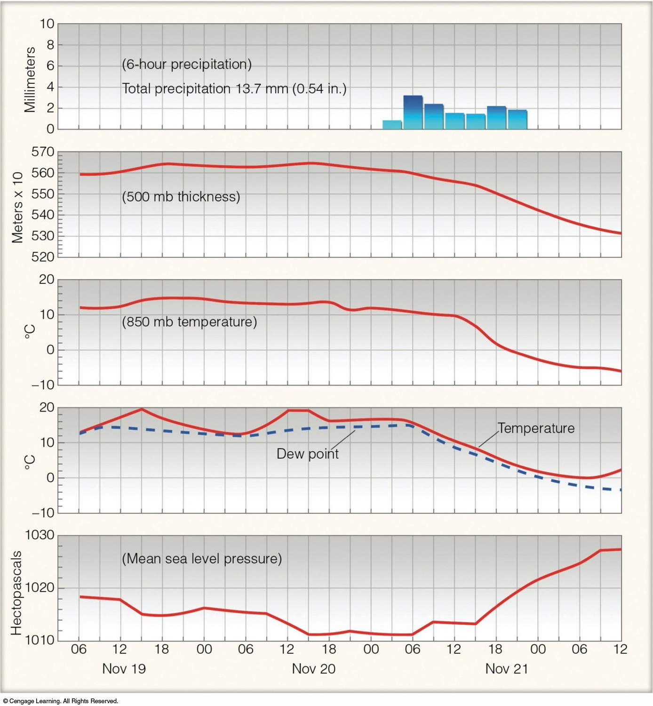

## Soundings

From radiosondes, shows 2D vertical profile of temp, dew point, and winds

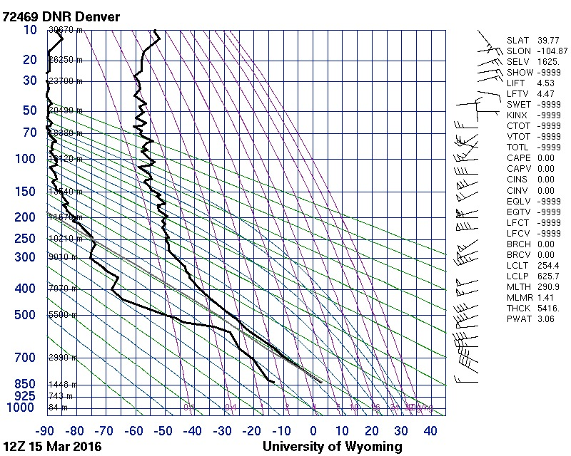

How to read:

- **Isobars:** horizontal blue lines of equal pressure
- **Isotherms:** vertical blue lines of equal temperature
- **Temperature curve:** thick black line on the right
- **Dew point temperature curve:** thick black line on the left
- **Wind observations:** Shown by wind barbs on the right side
- **Dry adiabat:** Green lines
- **Moist adiabat:** Purple lines

# Computer Forecasting

## Numerical Weather Prediction

Technique used to forecast weather using numerical models designed to represent atmospheric processes

## Prognostic Charts

Machine-generated maps of predicted future weather conditions

## Model Output Statistics (MOS)

A process for forecasting that corrects for model tendencies

## Ensemble Forecasting

A technique used for forecasting that produces multiple forecasts using the same model with slightly different initial conditions

# Other Forecasting Methods

## Persistence Forecasting

Based on the tendency of weather to remain unchanged for several hours or days

## Climatological Forecasting

Uses the average weather statistics measured over many years

## Analog Method

Based on the assumption that weather repeats itself, involves pattern recognition

## Trend Forecasting

Based on the speed and direction of features such as [fronts](#fronts), cyclones, clouds, and precipitation; see [nowcasting](#nowcast)

## Statistical Forecasting

Made routinely of weather elements based on the past performance of computer models, use [MOS](#model-output-statistics-mos)

## Probability Forecasting

Provides the probability that something will happen (i.e. a "white Christmas")

## Nowcast

A weather forecast that is good for a few hours

## Short-Range Forecasts

A weather forecast that is good from about 6 hours to a few days (usually up to 3 days)

## Medium-Range Forecasts

A weather forecast that is good from about 3-8 days

## Long-Range Forecasts

A weather forecast that extends beyond 8 days

### Climate Prediction Center

Provides 30 and 90-day outlooks. Not typical forecasts, but instead provide info on whether a region will be drier/wetter than normal or colder/warmer than normal

# Determining the Movement of Weather Systems

1. For short time intervals, mid-latitude cyclonic storms and [fronts](#fronts) tend to move in the same direction and at approximately the same speed as they did during the previous six hours
2. Low-pressure areas tend to move in a direction that parallels the isobars in the warm air (the [warm sector](#warm-sector)) ahead of the [cold front](#cold-fronts)
3. Lows tend to move toward the region of greatest surface pressure drop, whereas highs tend to move toward the region of greatest surface pressure rise
4. Surface pressure systems tend to move in the same direction as the wind at the 500mb level. The speed at which surface systems move is about half the speed of the winds at this level

# Thunderstorms

A storm that generates [lightning and thunder](#lightning-and-thunder). Usually produces gusty winds, heavy rain, and hail. They are convective storms that form in rising air.

## Thunderstorm Frequency

| Year | Day | Second | Current |
|---|---|---|---|
| >16 million thunderstorms | 45 thousand thunderstorms | 100 lightning strikes | 2 thousand thunderstorms |

## Anatomy of a Thunderstorm

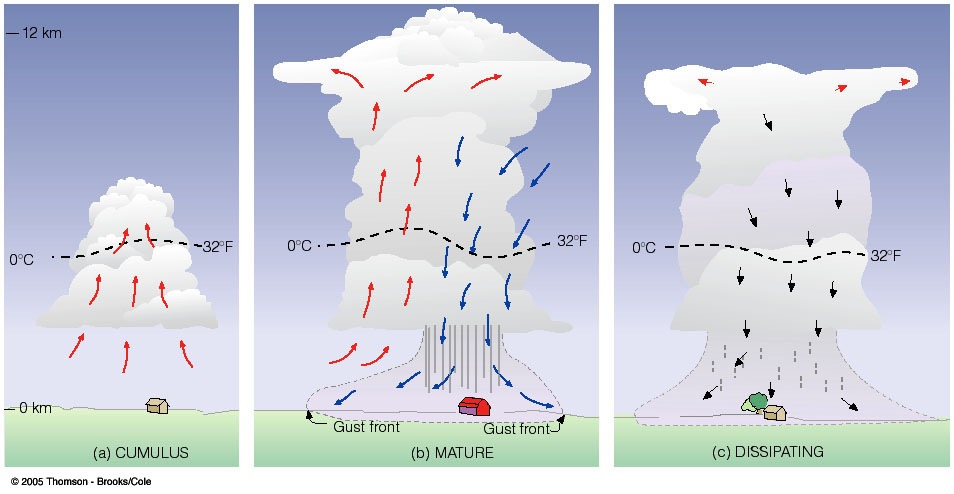

- **Updraft:** the rising motion which creates clouds and precipitation
- **Downdraft:** the sinking motion created by falling precipitation
- **Gust front:** the surface boundary that separates the advancing cooler air from the surrounding warmer air at the surface

## Vertical Wind Shear

The rate of change in wind speed and/or wind direction with height. Its impact on the orientation of the [updraft](#anatomy-of-a-thunderstorm) is the key difference between the different [types of thunderstorms](#types-of-thunderstorms)

# Types of Thunderstorms

## Table of Thunderstorm Characteristics

| Type | [VWS](#vertical-wind-shear) | [Updraft](#anatomy-of-a-thunderstorm) Orientation | [Downdraft](#anatomy-of-a-thunderstorm) Location | Duration | Instability | Strength |
|---|---|---|---|---|---|---|
| Air-Mass | weak | vertical | falls into and extinguishes the updraft | 15-30 mins | moderate | weak |
| Severe | strong | tilted | falls next to the updraft | 30+ mins | strong | strong |
| Supercell | strong | tilted and rotating | falls next to the updraft; often a second downdraft forms | many hours | very strong | strongest |

## Air-Mass Thunderstorm

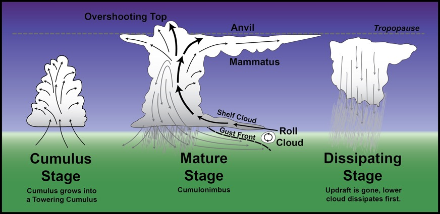

### Cumulus Stage

- Moist, unstable, rising air creates cumulus clouds
- Water vapor condenses into liquid or solid cloud particles, releasing large quantities of latent heat, keeping the rising air inside the cloud warmer than the air surrounding it
- No precipitation yet, the updrafts keep the water up in the cloud

### Mature Stage

- Falling precipitation creates a downdraft
- Downdraft causes entrainment, which brings drier air into the cloud
- Entrainment causes evaporation, which cools the air and enhances the downdraft
- Both an updraft and a downdraft exist at this stage
- Where the cold downdraft reaches the surface, the air spreads out horizontally in all directions creating the gust front

### Dissipating Stage

- Begins about 15-30 mins after the [Mature Stage](#mature-stage) starts
- Downdraft overpowers updraft, curring off the source of warm rising air to fuel the thunderstorm

## Severe Thunderstorm

A thunderstorm that contains at least one of the following criteria:

- Winds in excess of 58 mph
- Hailstones larger than 1 inch in diameter
- Produces a tornado

## Supercell Thunderstorm

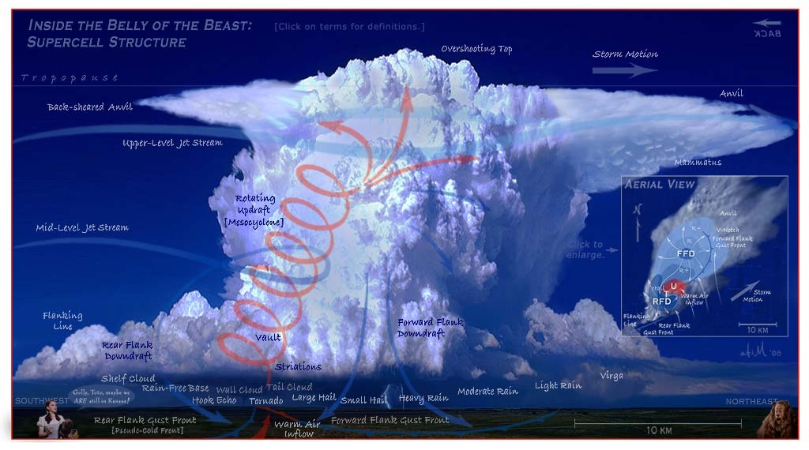

A thunderstorm that is 12-30 mi in diameter

# Lightning and Thunder

## Lightning

A discharge of electricity, a gian spark, which occurs in mature thunderstorms. It can heat up the air around it to 54,000 deg F.

Locations:

- Within a cloud
- Cloud to cloud
- Cloud to surrounding air
- Cloud to ground

### Electrical Potential Gradient

An imbalance of positive and negative charges causes lightning. Some cloud physicists believe this occurs through cloud droplet crystallization.

## Thunder

The extreme heat from lightning causes the air to expand explosively, thus initiating a shock wave that becomes a booming sound that travels outward in all directions

# Lightning Formation

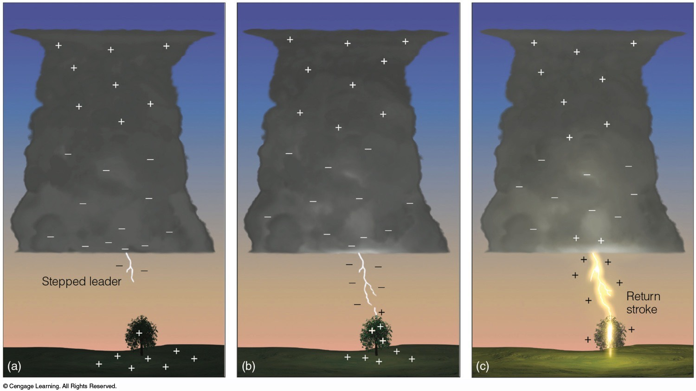

1. The [electrical potential gradient](#electrical-potential-gradient) becomes large enough to overcome the air's insulating properties and a flow of electrons called **the stepped leader** rushes towards the surface
2. As electrons approach the ground, a region of positive charge moves up into the air through any conducting object
3. When the downward flow of electrons meets the upward surge of positive charge, a strong eletrical current called the **return stroke** carries positive charge upward into the cloud

A single lightning flash consists of many return strokes.

# Tornadoes

A rapidly rotating column of air extending down from a cumulus cloud that is a small area of intense low pressure with a circulation that reaches the ground. The central pressure of a tornado can be 10% lower than the surrounding pressure. The friction at the surface causes winds to rush towards the center where it is forced vertically.

- **Tornado Alley:** Texas to Nebraska
- **Dixie Alley:** Mississippi and Alabama
- **Ideal Conditions:** warm, humid surface air is overlain by cooler, drier air aloft (conditionally unstable conditions) combined with strong [vertical wind shear](#vertical-wind-shear)

## Funnel Clouds

Refers to a visible funnel that does not reach the ground

## Suction Vortices

Some tornadoes consist of a single vortex, but more commonly smaller suction vortices are contained within the larger cell. These are referred to as **multiple vortex tornadoes**.

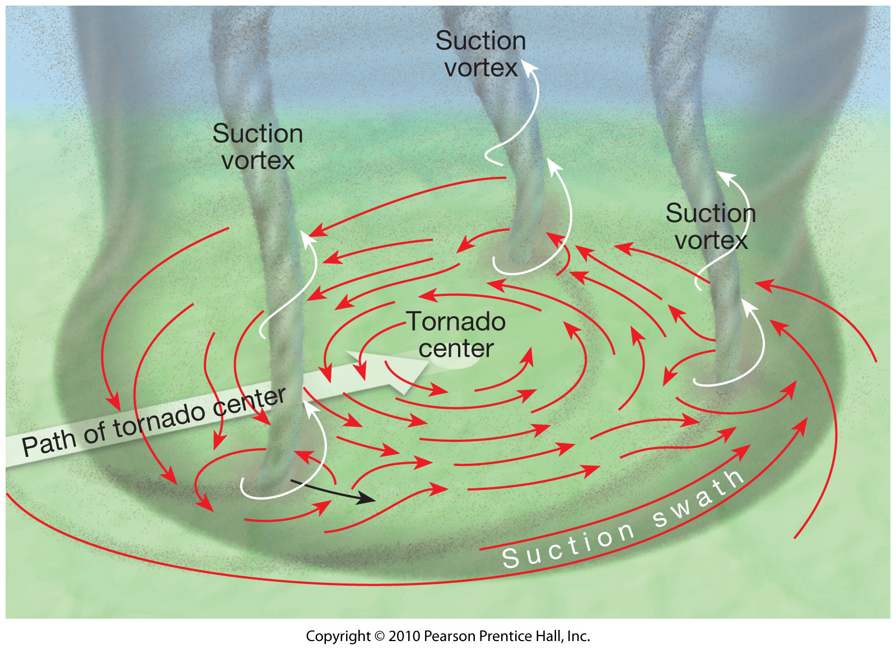

## Enhanced Fujita Scale (EF Scale)

A scale that uses the damage caused by the tornado to estimate the tornado wind speeds

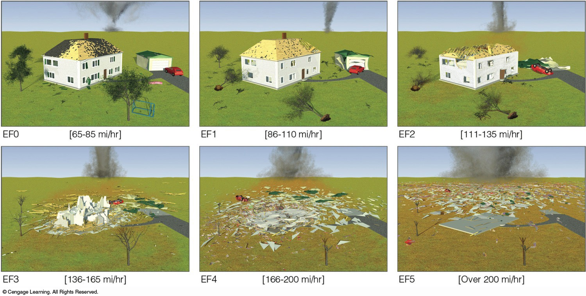

# Tornado Life Cycle

## Dust-whirl Stage

Dust swirling upward from the surface marks the tornado's circulation on the ground and a short funnel often extends downards from the thunderstorm's base

## Mature Stage

Damage is usually the most severe as the funnel reaches its greatest width and is almost vertical

## Decay Stage

The tornado stretches into the shape of a rope and dissipates

# Tornado Formation

Tornadoes are commonly associated with a [supercell thunderstorm](#supercell-thunderstorm).

## Vortex Tubes

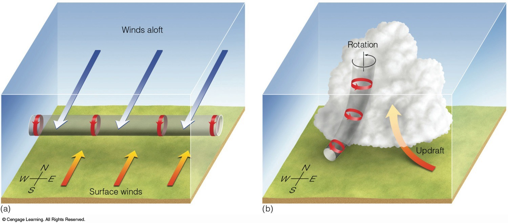

- The [wind shear](#vertical-wind-shear) causes the air near the surface to rotate about a horizontal axis
- The strong [updraft](#anatomy-of-a-thunderstorm) within the developing [thunderstorm](#thunderstorms) tilts the rotating tube upward and draws it into the storm
- The rotating shaft in the updraft lowers the pressure and enhances rising motion (adds more fuel to the storm)

## Rear Flank Downdraft

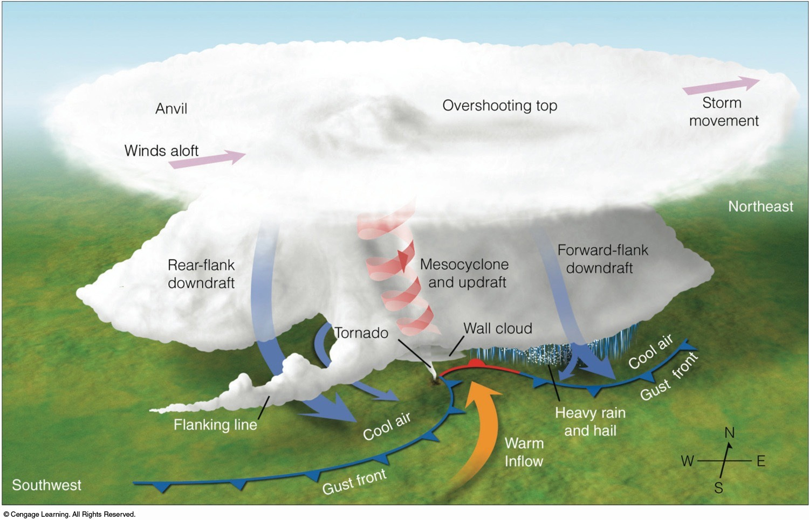

- The [updraft](#anatomy-of-a-thunderstorm), counterclockwise swirling precipitation, and the surrounding air create the rear flank downdraft
- The formation of the rear flank downdraft seems to play an important role in the formation of tornadoes

## Tornado Vortex

- The relatively cold air of the [downdrafts](#rear-flank-downdraft) wrap around the rotating column
- This causes the bottom of the column to rise slower than the top of the column, resulting in vertical stretching of the column, resulting in a faster spinning column (like a figure skater)
- This rapidly rotating column is known as a tornado vortex

# Tornado Forecasting

- **[Doppler Radar](#doppler-radar):** can determine rainfall intensities, and multiple doller systems can determine the motion of a storm system
- **Bounded weak echo region (BWER):** the region free of precipitation because the updraft is so strong taht precipitation cannot fall through it
- **Hook echo:** the precipitation that gets wrapped around the rotating updraft

# Useful Pictures

## Simplified Surface-Station Model

## Cloud Coverage

## Wind Entries

## Common Weather Symbols
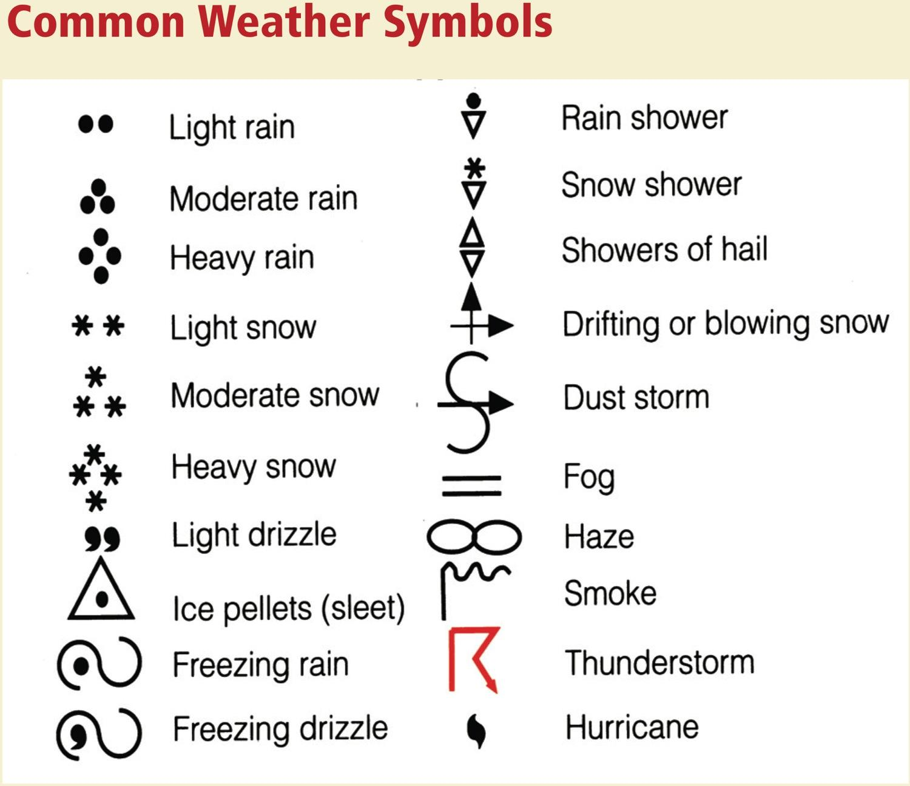
## Air Mass Classifications

## Front Symbols
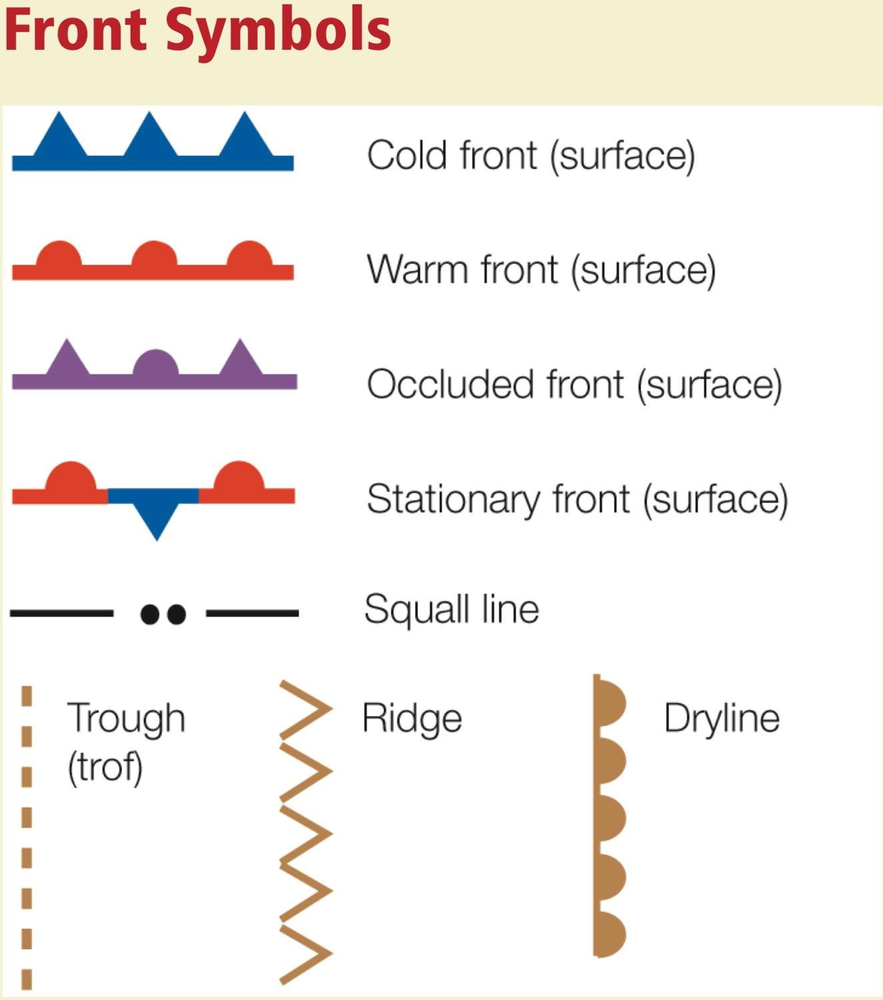
## Diagrams of Mid-Latitude Cyclones and Anti-Cyclones
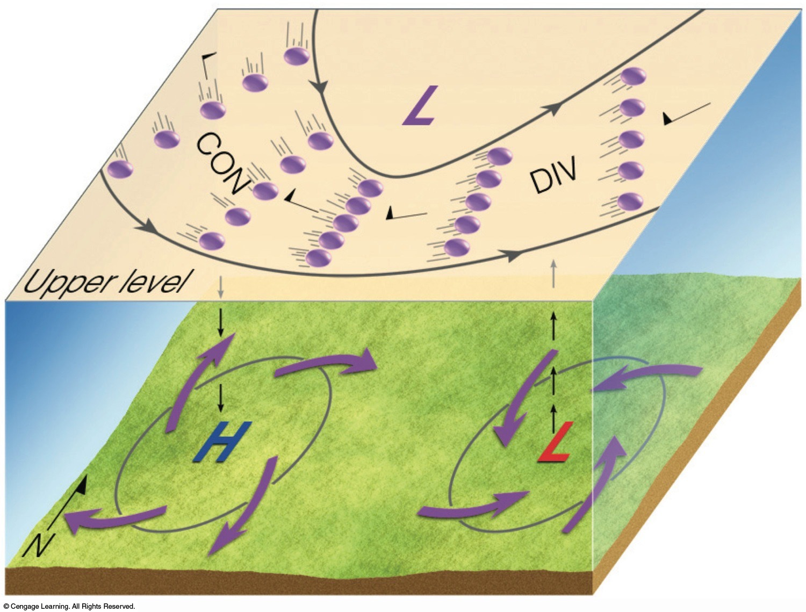

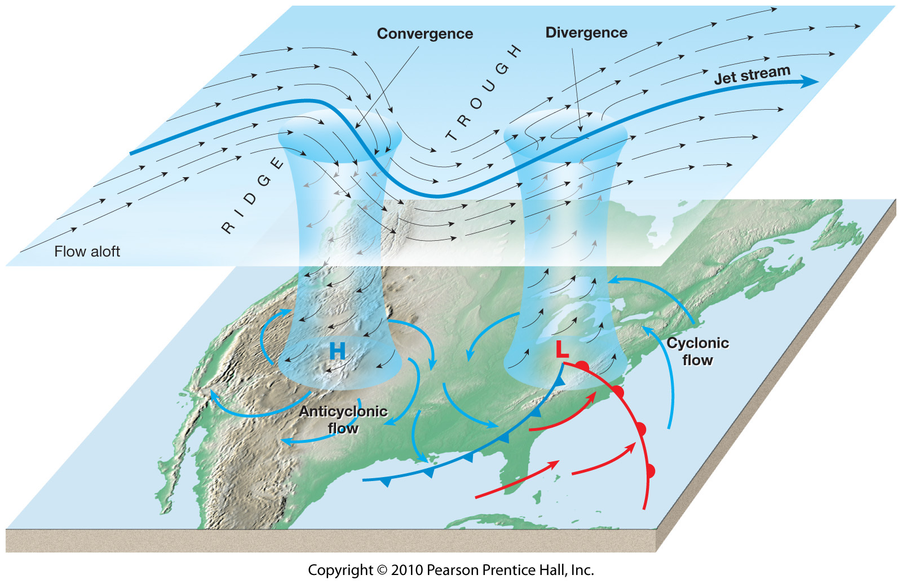

## Lightning Formation Detailed

